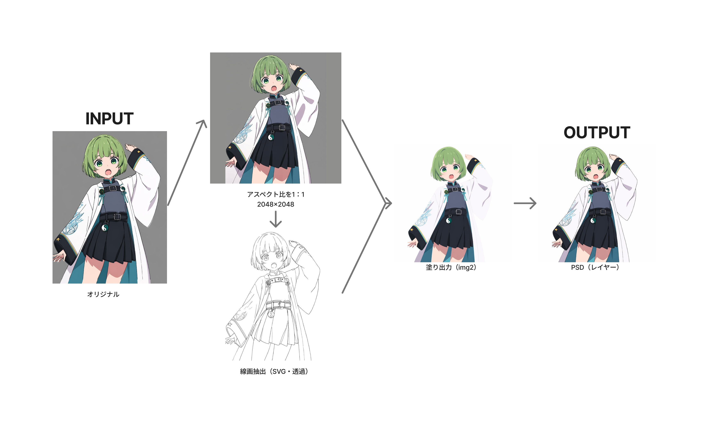

# lineart2psd

画像を入力して、線画抽出・AI生成・レイヤーPSD書き出しまでを自動で行うツール



## 処理の流れ
1. 入力画像を 2048×2048 にパディング（歪みなし）
2. 透過線画SVGを抽出
3. Gemini (`gemini-3.1-flash-image`) で画像生成（API要）
4. 元画像・生成画像・線画をレイヤーとしたPSDを出力

## 参照プロンプト
画像をのキャラクターを忠実に維持して、線画を消して、色塗だけの画像を出力してください。つまり黒い線を消して、色だけてキャラクターを出力してください。線画なし、輪郭線なし、境界線なし、参照カラー画像のカラーパレットを厳密に維持、元の陰影スタイルを維持、細部を再解釈しない、再設計しない、参照カラー画像の絶対的な忠実さで出力し、線画削除以外のいかなる細部も再解釈、再設計、再スタイル化しないでください

## セットアップ
```bash
python -m venv .venv
.venv\Scripts\activate      # Windows
pip install -r requirements.txt
```

## 起動
```bash
python app.py
```
ブラウザで `http://127.0.0.1:7860` が自動で開きます。

## Gemini APIキー
アプリ画面のテキストボックスから入力してください。コードやファイルには保存されません。
